# Completed-EmployeeManagement-Project-With-C-Dot-Net-Form-Framework
This is a HR/Employee Management system Project with C# Dot Net Form Application. Here there are two panel. Admin and Employee. Admin can Add, Remove, Update Employee, Generate Report, set next month Schedule, Add Department, Give notice. Employee can see his profile, apply for leave, see notices, see schedule and give attendance
# Project Details:
Open Solution File from project. connect your sqlserver with this project. with your sql server server name. than in sql server create the database and table which query are given in Query.spl file. change the connection string source. give your server name there. that's all
# Project images
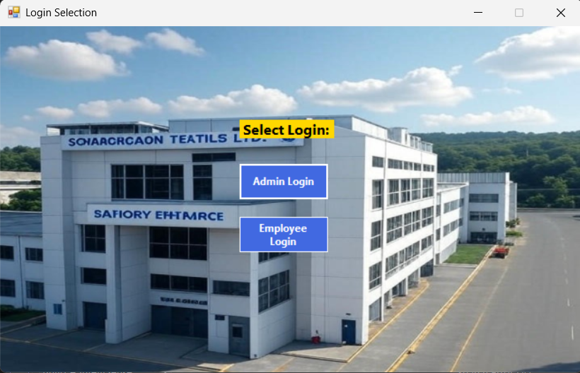
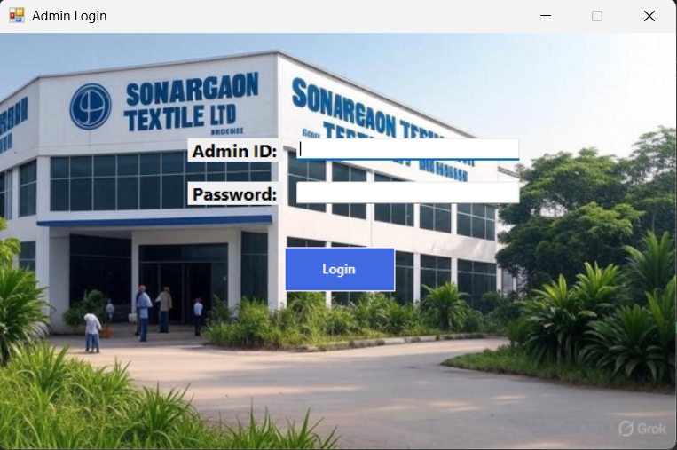
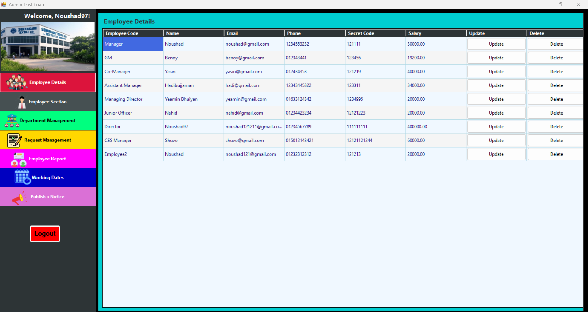

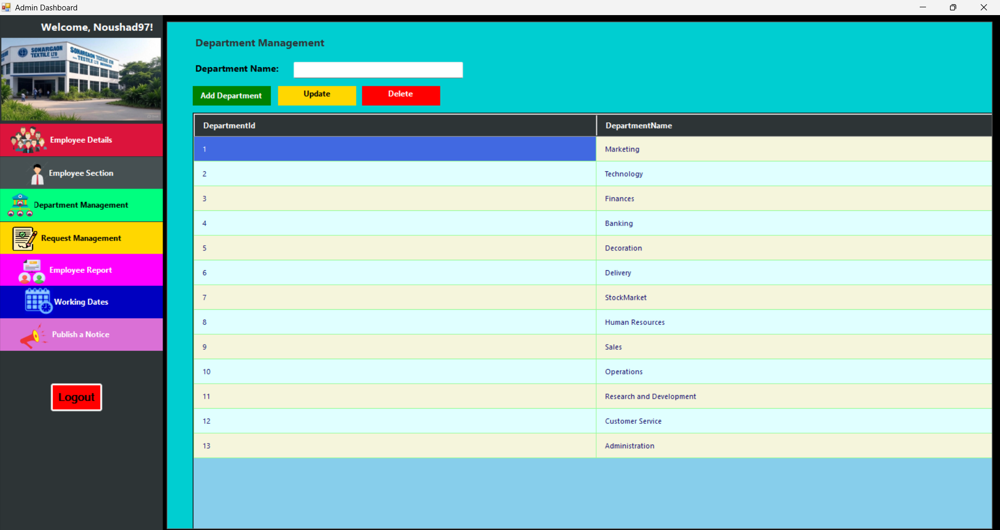
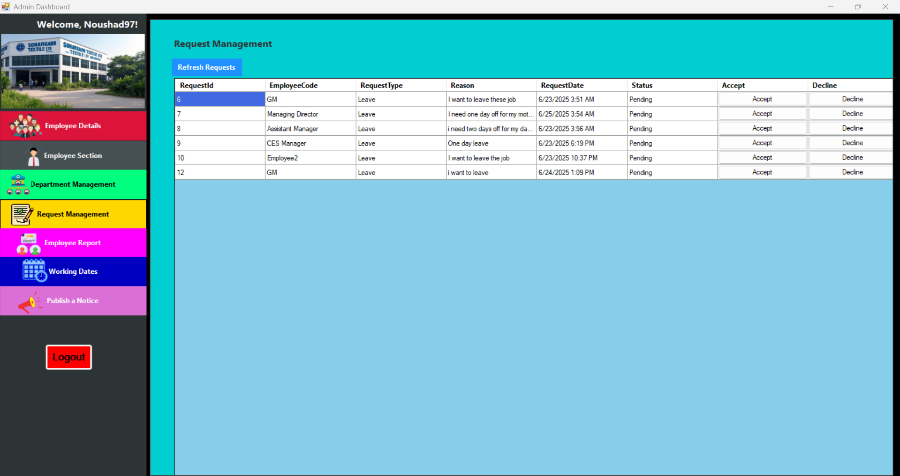
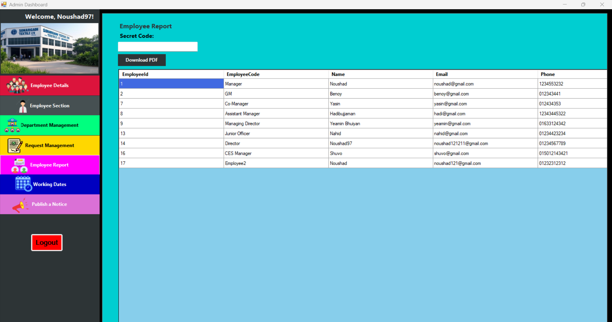
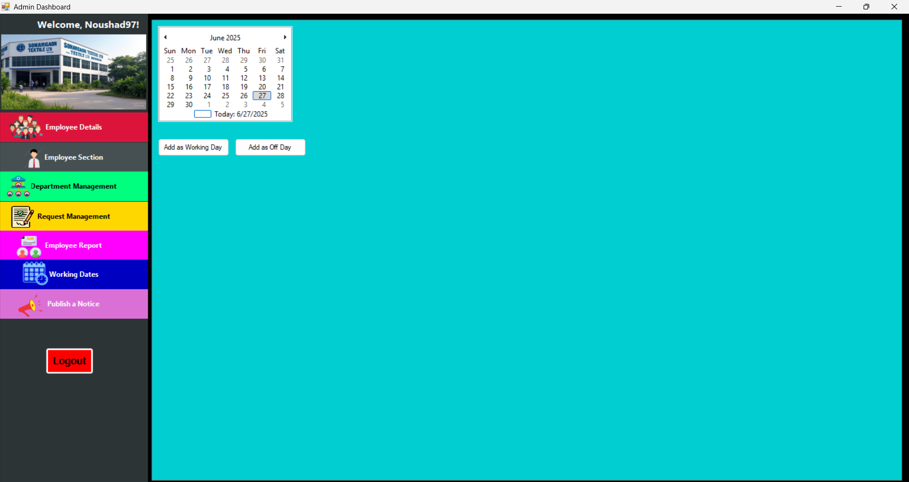
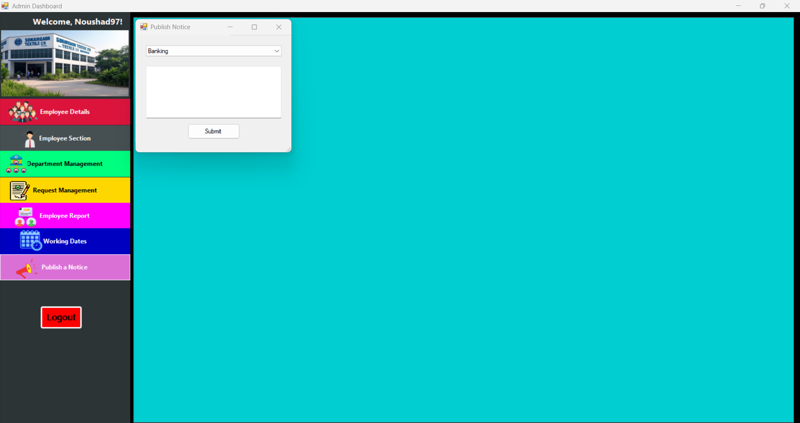
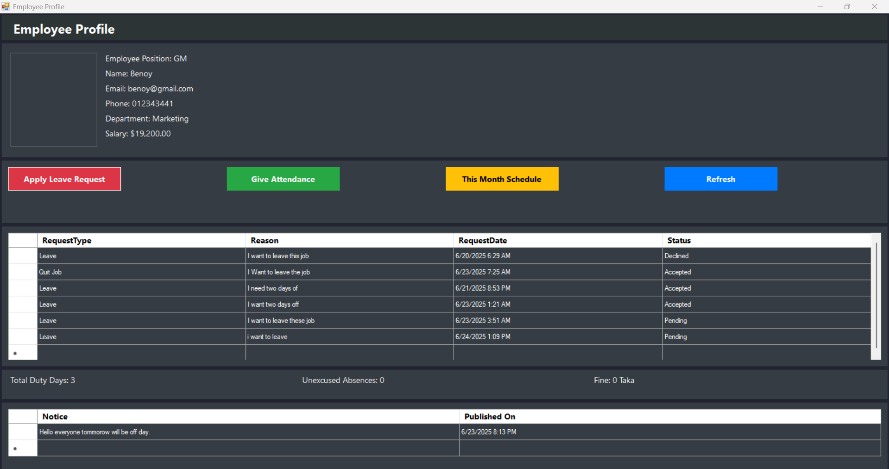
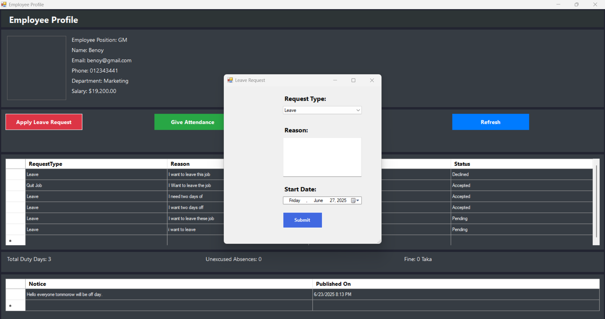
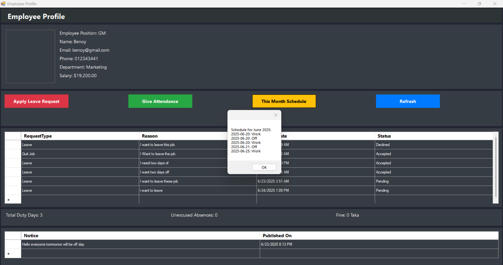
